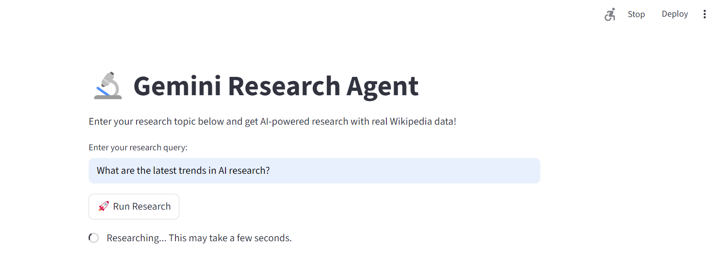
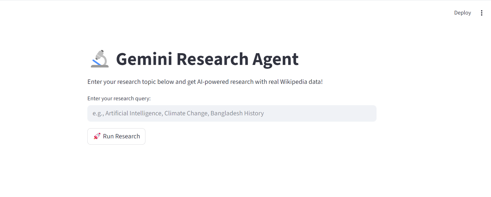

# 🌐 Gemini Research Agent - Main Application

<div align="center">


**AI-Powered Research Assistant with Web Interface**

</div>

## 📋 Table of Contents

- [Overview](#-overview-1)
- [Quick Start](#-quick-start)
- [How to Run](#-how-to-run-1)
- [Features](#-features)
- [Algorithms Used](#-algorithms-used-1)
- [Screenshots](#-screenshots-1)

## 🎯 Overview

The Main Application is the brain of Gemini Research Agent - a sophisticated web interface built with Streamlit that provides AI-powered research capabilities using LangChain and Gemini AI. Transform your research workflow with this intelligent assistant.

## 🚀 Quick Start

### Prerequisites
```bash
# Core Dependencies
pip install streamlit langchain-google-genai wikipedia-api python-dotenv pydantic

# Additional LangChain components
pip install langchain-core langchain-community

# For the main application
pip install langchain-agents
```

### Environment Setup
```env
GEMINI_API_KEY=your_gemini_api_key_here
```

## 🎮 How to Run

### Method 1: Streamlit Web App (Recommended)
```bash
# Run the main application
streamlit run app.py

# Access via browser: http://localhost:8501
```

### Method 2: Development Mode
```bash
# Run with detailed logging
streamlit run app.py --logger.level=debug
```

### Method 3: Terminal Version (Alternative)
```bash
# Uncomment terminal code in app.py and run
python app.py
```

## 🔥 Features

### 🎯 Core Capabilities
- **AI-Powered Research**: Gemini 2.0 Flash model integration
- **Structured Output**: Pydantic data validation
- **Multi-Tool Agent**: Search, Wikipedia, Save operations
- **Real-time Processing**: Live research with progress indicators
- **Web Interface**: Modern, responsive Streamlit UI

### 🛠️ Technical Features
- **Streamlit UI**: Modern web interface
- **LangChain Integration**: Agent-based architecture
- **Error Handling**: Graceful fallback mechanisms
- **JSON Output**: Structured data responses
- **Multi-format Support**: Both web and terminal interfaces

## 🧠 Algorithms Used

### 1. **Agent-Based Research Algorithm**
```python
# Zero-shot ReAct agent with tools
agent_executor = initialize_agent(
    tools=tools, 
    llm=llm,
    agent=AgentType.ZERO_SHOT_REACT_DESCRIPTION,
    verbose=True
)
```

### 2. **Structured Output Parsing**
```python
# Pydantic output parsing for consistent data
class ResearchResponse(BaseModel):
    topic: str
    summary: str
    sources: list[str]
    tools_used: list[str]

parser = PydanticOutputParser(pydantic_object=ResearchResponse)
```

### 3. **Prompt Engineering System**
```python
# Advanced prompt template with memory
prompt = ChatPromptTemplate.from_messages([
    ("system", "You are a research assistant..."),
    ("placeholder", "{chat_history}"),
    ("human", "{query}"),
    ("placeholder", "{agent_scratchpad}")
])
```

### 4. **Tool Integration Pipeline**
```python
# Intelligent tool routing system
tools = [
    Tool(name="Search", func=search_tool, description="Search for information"),
    Tool(name="Wiki", func=wiki_tool, description="Get Wikipedia summaries"),
    Tool(name="Save", func=save_tool, description="Save research outputs"),
]
```

## 📸 Screenshots




### Application Interface
```
🔬 Gemini Research Agent
Enter your research topic below and get AI-powered research with real Wikipedia data!

[Text Input] Enter your research query: [Artificial Intelligence           ]

[🚀 Run Research] Button
```

### Research Output Display
```
✅ Research Complete!

{
  "topic": "Artificial Intelligence",
  "summary": "Artificial intelligence (AI) is intelligence demonstrated by machines...",
  "sources": ["Wikipedia", "Research papers", "Academic studies"],
  "tools_used": ["Search", "Wiki", "Save"]
}

📊 Research Summary
Artificial intelligence (AI) is intelligence demonstrated by machines...

🔧 Tools Used
Search, Wiki, Save
```

## 🎯 How to Use the Application

### Step-by-Step Guide

1. **Launch the Application**
   ```bash
   streamlit run app.py
   ```

2. **Enter Your Research Query**
   - Type your topic in the text box
   - Examples: 
     - "Artificial Intelligence"
     - "Climate Change" 
     - "Machine Learning Applications"
     - "Renewable Energy Technologies"

3. **Initiate Research**
   - Click the "🚀 Run Research" button
   - Watch the real-time progress spinner

4. **Analyze Results**
   - View structured JSON output
   - Read the research summary
   - Check which tools were used
   - See information sources

### Advanced Usage Tips

- **Complex Queries**: Use specific questions like "Impact of AI on healthcare"
- **Comparative Research**: "Difference between machine learning and deep learning"
- **Technical Topics**: "Neural networks architecture and applications"

## 🏗️ Application Architecture

```
Main Application (app.py)
├── 🔌 Streamlit UI Layer (User Interface)
├── 🧠 LangChain Agent Layer (AI Logic)  
├── 🤖 Gemini AI Model Layer (Language Model)
├── 🛠️ Tools Integration Layer (Search/Wiki/Save)
└── 💾 Data Persistence Layer (JSON Storage)
```

## ⚡ Performance Optimization

### Response Time Optimization
```python
# Optimized model configuration
llm = ChatGoogleGenerativeAI(
    model="gemini-2.0-flash-001",
    temperature=0.1,  # Lower temperature for consistent results
    google_api_key=GEMINI_API_KEY
)
```

### Memory Management
```python
# Efficient prompt design
prompt = ChatPromptTemplate.from_messages([
    ("system", "Be concise and structured..."),
    ("human", "{query}")
])
```

## 🐛 Troubleshooting Guide

### Common Issues & Solutions

1. **Streamlit Connection Error**
   ```bash
   # Change to different port
   streamlit run app.py --server.port 8502
   ```

2. **Gemini API Rate Limits**
   - Check your quota in Google AI Studio
   - Implement request delays if needed

3. **JSON Parsing Errors**
   - Application automatically falls back to raw output
   - Check the prompt formatting in code

4. **Tool Execution Failures**
   - Verify internet connection for Wikipedia access
   - Check file write permissions for save operations
   - Ensure all dependencies are installed

5. **Module Import Errors**
   ```bash
   # Reinstall requirements
   pip install -r requirements.txt
   ```

### Debug Mode
```python
# Enable verbose logging
agent_executor = initialize_agent(
    tools=tools, 
    llm=llm,
    agent=AgentType.ZERO_SHOT_REACT_DESCRIPTION,
    verbose=True,  # Set to True for detailed logs
    handle_parsing_errors=True
)
```

## 🔄 Workflow Diagram

```
User Input 
    ↓
Streamlit Interface
    ↓
LangChain Agent Processor
    ↓
Gemini AI Model
    ↓
Tools Execution (Search/Wiki/Save)
    ↓
Structured Output Generation
    ↓
Web Display + Data Storage
```

## 🌟 Advanced Features

### Custom Research Templates
```python
# Specialized research modes
research_modes = {
    "academic": "Provide academic research with citations and references...",
    "technical": "Give technical deep dive with specifications and implementations...",
    "overview": "Create general overview with key points and applications..."
}
```

### Multi-language Research
```python
# International research support
language_support = {
    "english": "Research in English with international sources",
    "bengali": "বাংলায় গবেষণা এবং স্থানীয় উৎস",
    "hindi": "हिंदी में शोध और स्थानीय स्रोत"
}
```

---

<div align="center">

**🌐 Main Application - Intelligent Research at Your Fingertips**

*"Transforming Research with AI Power"*

[🚀 Get Started] • [📚 Documentation] • [🐛 Report Issues]

</div>