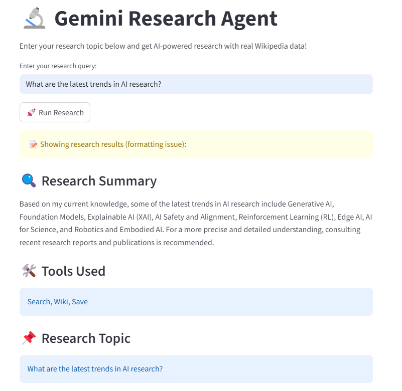

# 🛠️ Gemini Research Agent - Tools Module

<div align="center">


**Research Agent's Tools Collection - Smart Search and Data Management**

</div>

## 📋 Table of Contents

- [Overview](#-overview)
- [Installation](#-installation)
- [Tools Description](#-tools-description)
- [How to Run](#-how-to-run)
- [Algorithms Used](#-algorithms-used)
- [Screenshots](#-screenshots)

## 🎯 Overview

The Tools Module is the heartbeat of Gemini Research Agent! It provides various intelligent tools that help in AI-powered research. This module handles everything from searching information to saving research data.

## 🚀 Installation

### Prerequisites
```bash
# Required Python Version
Python 3.8 or higher

# Required Libraries
pip install google-generativeai wikipedia-api python-dotenv
```

### Environment Setup
1. **Get API Keys:**
   - Get Gemini API Key from [Google AI Studio](https://makersuite.google.com/app/apikey)
   - No key needed for Wikipedia API

2. **Create `.env` file:**
```env
GEMINI_API_KEY=your_actual_gemini_api_key_here
```

## 🔧 Tools Description

### 1. 🔍 Search Tool (`search_tool`)
```python
def search_tool(query: str) -> str
```
**Functionality:** Provides simulated search results  
**Input:** Search query  
**Output:** Formatted search results  
**Usage:**
```python
from tools import search_tool
result = search_tool("Artificial Intelligence")
```

### 2. 📚 Wikipedia Tool (`wiki_tool`)
```python
def wiki_tool(topic: str) -> str
```
**Functionality:** Fetches verified information from Wikipedia  
**Input:** Topic name  
**Output:** Summary (500 characters)  
**Features:**
- Multi-language support (EN/BN)
- Error handling
- Auto-truncation

### 3. 💾 Save Tool (`save_tool`)
```python
def save_tool(data: Dict) -> str
```
**Functionality:** Saves research data to JSON file  
**Input:** Dictionary data  
**Output:** Success/Error message  
**Data Format:** `saved_research.json`

### 4. 🤖 Model Checker (`check_models.py`)
```python
# Available Gemini models check
```
**Functionality:** Lists all available Gemini models  
**Features:** Shows model names and supported methods

## 🎮 How to Run

### Individual Tools Test
```bash
# 1. First check models
python check_models.py

# 2. Test individual tools
python -c "
from tools import search_tool, wiki_tool, save_tool
print('🔍 Search:', search_tool('AI'))
print('📚 Wiki:', wiki_tool('Machine Learning'))
print('💾 Save:', save_tool({'test': 'data'}))
"
```

### Complete Tools Testing
```python
# Create test_tools.py file
from tools import *

# Test all tools
query = "Deep Learning"
print("1.", search_tool(query))
print("2.", wiki_tool(query)) 
print("3.", save_tool({"topic": query, "data": "test"}))
```

### Expected Output
```
🔍 Search results for 'Deep Learning': ['Research paper...', 'Latest news...']
📚 Wikipedia Summary for 'Deep Learning': Deep learning is part of...
💾 Data saved successfully!
```

## 🧠 Algorithms Used

### 1. **API Integration Algorithm**
```python
# Wikipedia API with error handling
try:
    page = wiki_wiki.page(topic)
    if page.exists():
        return processed_summary
except Exception as e:
    return error_message
```

### 2. **Data Persistence Algorithm**
```python
# JSON data saving with encoding
with open("saved_research.json", "a", encoding="utf-8") as f:
    f.write(json.dumps(data, ensure_ascii=False) + "\n")
```

### 3. **Model Discovery Algorithm**
```python
# Gemini models enumeration
for model in genai.list_models():
    print(f"Model: {model.name}")
    print(f"Methods: {model.supported_generation_methods}")
```

## 📸 Screenshots


### Tools Module Structure
```
tools/
├── 📄 check_models.py    # Model discovery
├── 📄 tools.py          # Main tools collection  
├── 📄 saved_research.json # Research database
└── 📄 .env              # API configuration
```

### Sample Output
```
Model: models/gemini-pro
Supported methods: ['generateContent', 'countTokens']
---
🔍 Search results for 'AI': ['Research paper about AI', 'Latest news on AI']
📚 Wikipedia Summary for 'Machine Learning': Machine learning (ML) is...
💾 Data saved successfully!
```

### JSON Data Structure
```json
{
  "trends": [
    "Advancements in Generative AI",
    "Reinforcement Learning",
    "Explainable AI (XAI)"
  ]
}
```

## 🛠️ Customization

### Language Change
```python
# Bengali Wikipedia
wiki_wiki = wikipediaapi.Wikipedia(language='bn')
```

### Summary Length
```python
# Increase summary size
if len(page.summary) > 1000:
    summary = page.summary[0:1000] + "..."
```

## ❓ Troubleshooting

### Common Issues
1. **API Key Error:** Check `.env` file
2. **Wikipedia Access:** Check internet connection  
3. **JSON Error:** Delete `saved_research.json` file and try again

### Debug Mode
```python
# Verbose debugging
import logging
logging.basicConfig(level=logging.DEBUG)
```

---

<div align="center">

**🛠️ Tools Module - Powerful Tools Collection for Research**

*"Smart Tools, Smart Research"*

</div>

---
